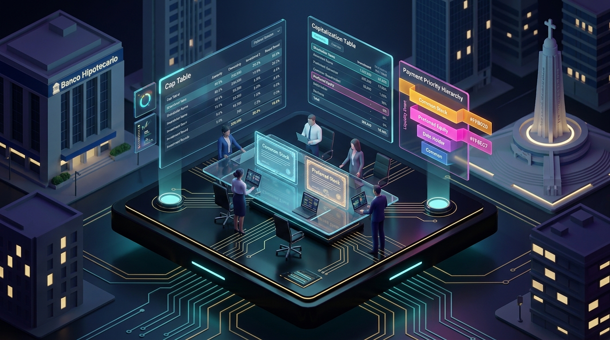
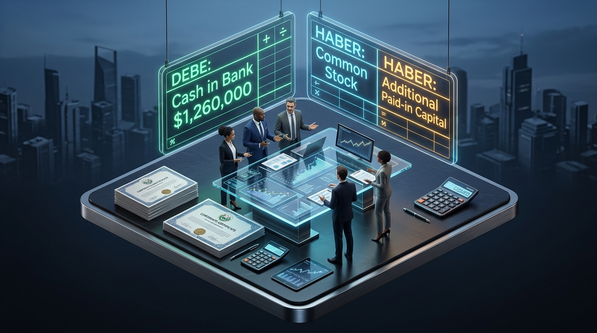

# Prompts de Imagen IA — Unidad 2 (Transacciones de Capital)

Este documento contiene los prompts maestros en inglés optimizados para **Nanobanana (Google Imagen 3)** y **ChatGPT (DALL-E 3)** para generar los 5 visuales explicativos de cabecera de panel (`.panel-visual`) de la **Unidad 2**, con la estética **3D Isométrica Fintech Oscuro** establecida en la Unidad 1.

---

## Parámetros Globales de Generación

- **Estilo visual**: 3D Isometric Dark Fintech Illustration, alta resolución, renderizado fotorrealista de elementos de vidrio, acrílico e iluminación volumétrica.
- **Relación de aspecto**: `16:9` (1024 × 576 px o superior).
- **Fondo dominante**: Obsidiana / grafito oscuro (`#0B0D10` y `#14171C`).
- **Acentos de color**: Ámbar (`#FFB020`), Rosa Patrimonio (`#FF6EC7`), Azul Legal (`#5AC8FA`), Verde Éxito (`#3ECF8E`).
- **Contexto**: Corporativo salvadoreño moderno (arquitectura financiera, San Salvador, Sonsonate).
- **Ubicación de guardado**: `Entregables/assets/unidad-2/` y su espejo en `docs/assets/unidad-2/`.

---

## 1. Panel 1 — Resumen Visual: Estructura del Capital y Prelación

**Archivo destino:** `u2-panel-1-resumen-capital.png`  
**Estado:** Generado con Nanobanana ✅  
**Ubicación HTML:** Cabecera del Panel 1 (`#panel-1`)

### Prompt:
```text
A sophisticated 3D isometric dark fintech illustration representing corporate capital transactions and shareholder equity in El Salvador. On a sleek dark obsidian floating podium #0B0D10 with subtle glowing circuitry, an executive glass conference table features luminous digital certificates for common and preferred stock. Floating holographic screens show capitalization tables (Cap Table), payment priority hierarchy ribbons in vibrant amber #FFB020 and neon pink #FF6EC7, and subtle El Salvador financial district architectural background with the Monumento al Divino Salvador del Mundo. High-end modern financial technology design, elegant, clean, hyper-detailed, premium UI aesthetic. 16:9 aspect ratio.
```

### Integración HTML:
```html
<figure class="panel-visual">
  
  <figcaption><strong>FIG. 2.1 · ESTRUCTURA DEL CAPITAL:</strong> Constitución de Sociedad Anónima, emisión de acciones comunes vs preferentes y orden de prelación en el Patrimonio.</figcaption>
</figure>
```

---

## 2. Panel 2 — Ejercicio Resuelto: Emisión de Acciones (XYZ, S.A. de C.V.)

**Archivo destino:** `u2-panel-2-ejercicio-resuelto.png`  
**Estado:** Generado con Nanobanana ✅  
**Ubicación HTML:** Cabecera del Panel 2 (`#panel-2`)

### Prompt:
```text
A premium 3D isometric dark fintech corporate scene depicting financial accounting for corporate stock issuance in El Salvador. On a floating dark slate platform #0B0D10, corporate finance analysts and investors meet around an illuminated glass trading desk. Dual floating holographic ledger screens show double-entry accounting journal entries: 'DEBE: Cash in Bank $1,260,000' in glowing emerald green #3ECF8E, and 'HABER: Common Stock & Additional Paid-in Capital' in glowing cyan #5AC8FA and amber #FFB020. Stacks of high-end corporate share certificates with wax seals, digital calculators, financial charts, ultra-clean modern corporate aesthetic, hyper-detailed. 16:9 aspect ratio.
```

### Integración HTML:
```html
<figure class="panel-visual">
  
  <figcaption><strong>FIG. 2.2 · EMISIÓN Y PRIMA EN ACCIONES:</strong> Registro contable en XYZ, S.A. de C.V. de 10,000 acciones comunes y 1,000 preferentes con $1,260,000.00 ingresados a banco.</figcaption>
</figure>
```

---

## 3. Panel 3 — Guía Excel: Modelado Financiero de Capital

**Archivo destino:** `u2-panel-3-guia-excel.png`  
**Estado:** Listo para generar en ChatGPT / Nanobanana  
**Ubicación HTML:** Cabecera del Panel 3 (`#panel-3`)

### Prompt:
```text
A high-tech 3D isometric dark fintech data modeling laboratory illustrating advanced corporate finance Excel modeling for shareholders equity. On a dark obsidian floating workstation #0B0D10, floating translucent glass spreadsheets glow with neon green #3ECF8E, amber #FFB020, and cyan #5AC8FA cell matrices. Glowing vector formula light-beams connect multiple floating spreadsheet sheets (Sheet 3 Calculation -> Sheet 5 Journal Entries -> Sheet 7 Balance Sheet). Micro-charts, capitalization formulas, financial modeling tools, clean typography, luxury fintech dark mode aesthetic. 16:9 aspect ratio.
```

### Integración HTML:
```html
<figure class="panel-visual">
  
  <figcaption><strong>FIG. 2.3 · MODELADO EN EXCEL:</strong> Cadena de fórmulas entre el cálculo de emisión, partida de diario y presentación del Patrimonio en el Balance General.</figcaption>
</figure>
```

---

## 4. Panel 4 — Quiz de Práctica: Autoevaluación Interactiva

**Archivo destino:** `u2-panel-4-quiz-practica.png`  
**Estado:** Listo para generar en ChatGPT / Nanobanana  
**Ubicación HTML:** Cabecera del Panel 4 (`#panel-4`)

### Prompt:
```text
A 3D isometric dark fintech futuristic learning hub and interactive knowledge assessment center for corporate finance. Floating on a sleek dark slate platform #0B0D10 with glowing circuits, multiple holographic interactive quiz cards float in the air with glowing checkmark badges in emerald green #3ECF8E and amber #FFB020. A central glowing digital score ring shows high achievement, surrounded by floating node diagrams illustrating stock split, treasury shares, par value, and market value. Clean, sophisticated educational technology aesthetic, hyper-detailed, dark mode. 16:9 aspect ratio.
```

### Integración HTML:
```html
<figure class="panel-visual">
  
  <figcaption><strong>FIG. 2.4 · AUTOEVALUACIÓN INTERACTIVA:</strong> Reactivos con retroalimentación inmediata sobre los 4 valores de una acción, acciones de tesorería y dividendos.</figcaption>
</figure>
```

---

## 5. Panel 5 — Ejercicio Variante: Caso Textiles Izalco (Sonsonate)

**Archivo destino:** `u2-panel-5-ejercicio-variante.png`  
**Estado:** Listo para generar en ChatGPT / Nanobanana  
**Ubicación HTML:** Cabecera del Panel 5 (`#panel-5`)

### Prompt:
```text
A high-end 3D isometric fusion of modern industrial textile manufacturing in El Salvador and corporate equity finance. On a floating dark obsidian platform #0B0D10, a futuristic textile workshop features sleek industrial sewing machinery, rolls of fine fabric in emerald green #3ECF8E and amber #FFB020, integrated with floating holographic financial dashboard screens displaying corporate treasury stock purchase and dividend payouts for 'Textiles Izalco, Sonsonate'. Sophisticated corporate factory aesthetic, dramatic lighting, clean, hyper-detailed. 16:9 aspect ratio.
```

### Integración HTML:
```html
<figure class="panel-visual">
  
  <figcaption><strong>FIG. 2.5 · CASO PRÁCTICO Y TESORERÍA:</strong> Caso Textiles Izalco en Sonsonate, emisión textil, compra de acciones de tesorería y pago de dividendo con retención de ISR.</figcaption>
</figure>
```

---

## Regla CSS de soporte (en caso de no estar en el HTML)

```css
.panel-visual {
  margin: 0 0 28px 0;
  border: 1px solid var(--border);
  border-radius: 12px;
  overflow: hidden;
  background: var(--bg-elev);
  position: relative;
  box-shadow: 0 10px 30px rgba(0, 0, 0, 0.35);
}
.panel-visual img {
  width: 100%;
  height: auto;
  aspect-ratio: 16/9;
  display: block;
  object-fit: cover;
  border-bottom: 1px solid var(--border);
}
.panel-visual figcaption {
  padding: 12px 18px;
  background: var(--bg-elev2);
  color: var(--text-dim);
  font-family: 'IBM Plex Mono', monospace;
  font-size: 0.75rem;
  letter-spacing: 0.02em;
  line-height: 1.5;
}
.panel-visual figcaption strong {
  color: var(--accent);
}
```
